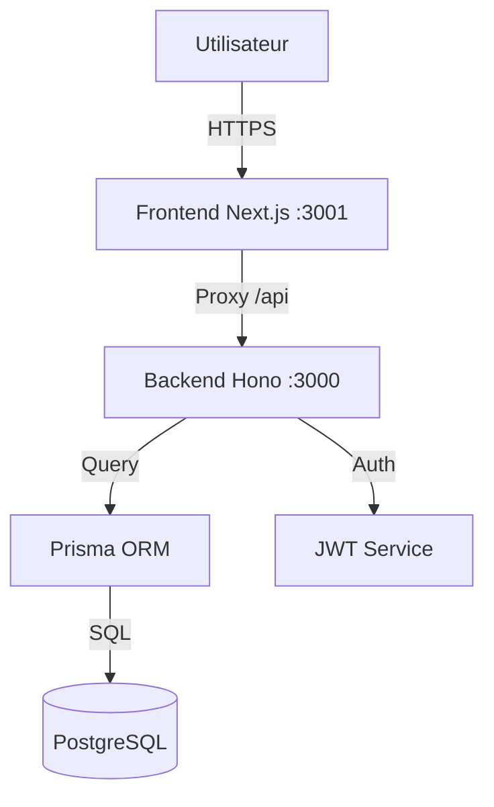

# 🏥 SamaSanté - Plateforme de Santé Numérique du Sénégal

> **Votre santé, notre priorité.** Connecter patients, médecins et hôpitaux pour un Sénégal en meilleure santé.

[](https://www.typescriptlang.org/)
[](https://nextjs.org/)
[](https://www.prisma.io/)
[](LICENSE)

---

## 📋 Table des Matières

- [🎯 Aperçu](#-aperçu)
- [✨ Fonctionnalités](#-fonctionnalités)
- [🛠️ Stack Technique](#-stack-technique)
- [🚀 Installation](#-installation)
- [⚙️ Configuration](#-configuration)
- [📖 Utilisation & Comptes de Test](#-utilisation--comptes-de-test)
- [🏗️ Architecture](#-architecture)
- [🔌 API](#-api)
- [🚢 Déploiement](#-déploiement)
- [👥 Contribution](#-contribution)

---

## 🎯 Aperçu

**SamaSanté** est une plateforme SaaS souveraine conçue pour moderniser l'accès aux soins au Sénégal. Elle offre une solution centralisée pour la gestion des parcours de soins, de la prise de rendez-vous à la gestion hospitalière.

### 🌍 Contexte & Solution

Au Sénégal, l'accès aux soins peut être complexe. **SamaSanté** résout ces défis :

| Problème  | Solution SamaSanté |
|----------|-------------------|
| ❌ Files d'attente interminables | ✅ **Rendez-vous en ligne 24/7** |
| ❌ Dossiers papiers perdus | ✅ **Dossier Médical Partagé (DMP) sécurisé** |
| ❌ Manque de coordination | ✅ **Interconnexion Hôpitaux-Médecins** |
| ❌ Données dispersées | ✅ **Monitoring national en temps réel** |

---

## ✨ Fonctionnalités

### 👤 Espace Patient

- **Prise de rendez-vous** intuitive avec recherche par spécialité/quartier.
- **Dossier médical** numérique (ordonnances, résultats d'analyses).
- **Historique** des consultations.
- **Rappels SMS/Email** automatiques.

### 👨‍⚕️ Espace Médecin

- **Gestion d'agenda** et des disponibilités.
- **Dossiers patients** accessibles en un clic.
- **Prescription électronique** sécurisée.
- **Tableau de bord** d'activité.

### 🏥 Espace Hôpital

- **Gestion multi-services** et du personnel.
- **Vue d'ensemble** des admissions et lits.
- **Statistiques** de fréquentation.

### ⚡ Espace Super Admin (Ministère/Autorité)

- **Monitoring global** de la plateforme.
- **Gestion des établissements** de santé.
- **Audit et sécurité**.

---

## 🛠️ Stack Technique

Une architecture moderne, robuste et sécurisée.

### Frontend (Client)

- **Framework** : Next.js 15 (App Router)
- **Langage** : TypeScript
- **UI/UX** : Tailwind CSS, Radix UI, Shadcn/ui, Lucide React
- **État** : React Hooks, SWR
- **Formulaires** : React Hook Form, Zod

### Backend (API)

- **Framework** : Hono (Ultra-rapide)
- **Runtime** : Node.js
- **Base de données** : PostgreSQL
- **ORM** : Prisma
- **Authentification** : JWT (HttpOnly Cookies), Bcrypt
- **Sécurité** : Rate Limiting, Helmet, CORS strict

---

## 🚀 Installation

### Prérequis

- Node.js 18+
- PostgreSQL
- Git

### 1. Cloner le projet

```bash
git clone https://github.com/votre-org/samasante-web.git
cd samasante-web
```

### 2. Installer les dépendances

```bash
# Racine (Frontend)
npm install

# Backend
cd backend
npm install
cd ..
```

### 3. Configuration de la Base de Données

```bash
cd backend
cp .env.example .env
# Modifier .env avec vos accès DB
npx prisma generate
npx prisma migrate dev
npx prisma db seed # (Optionnel) Données de base
```

### 4. Lancer le développement

```bash
# Terminal 1 : Backend (Port 3000)
cd backend
npm run dev

# Terminal 2 : Frontend (Port 3001)
# Le frontend utilise un proxy vers le backend
npm run dev
```

Accédez à l'application sur **[http://localhost:3001](http://localhost:3001)**.

---

## 📖 Utilisation & Comptes de Test

Pour explorer la plateforme, utilisez ces comptes de démonstration (Données fictives) :

| Rôle | Email | Mot de passe | Accès |
|------|-------|--------------|-------|
| 👤 **Patient** | `amadou.diallo@test.sn` | `Patient@2024!Secure` | `/patient` |
| 👨‍⚕️ **Docteur** | `fatou.sall@test.sn` | `Doctor@2024!Secure` | `/doctor` |
| 🏥 **Hôpital** | `moussa.ndiaye@test.sn` | `Hospital@2024!Secure` | `/hospital` |
| ⚡ **Admin** | `awa.thiam@test.sn` | `Admin@2024!SuperSecure` | `/super-admin` |

> **Note** : Le système de sécurité inclut une protection contre les attaques par force brute. Après 5 tentatives échouées, le compte est temporairement bloqué.

---

## 🏗️ Architecture

L'application utilise une architecture **Monorepo** simplifiée avec séparation claire des responsabilités.



### Sécurité

- **Cookies HttpOnly** : Protection contre XSS.
- **Proxy Reverse** : Masquage de l'architecture interne.
- **Validation Zod** : Intégrité des données entrantes.

---

## 🔌 API

Documentation Swagger disponible en développement sur :
`http://localhost:3000/api/docs`

### Endpoints Clés

- `POST /auth/login` : Connexion sécurisée
- `GET /patients/me` : Profil patient
- `GET /appointments` : Liste des rendez-vous
- `GET /monitoring/stats` : Statistiques globales

---

## 👥 Contribution

Les contributions sont les bienvenues pour améliorer la santé au Sénégal !

1. Forker le projet
2. Créer une branche (`git checkout -b feature/MaSuperFeature`)
3. Commit (`git commit -m 'Ajout de MaSuperFeature'`)
4. Push (`git push origin feature/MaSuperFeature`)
5. Ouvrir une Pull Request

---

## 📄 Licence

Distribué sous licence MIT. Voir `LICENSE` pour plus d'informations.

---

<div align="center">
  <b>Fait avec ❤️ à Dakar, Sénégal 🇸🇳</b><br>
  SamaSanté © 2025
</div>
